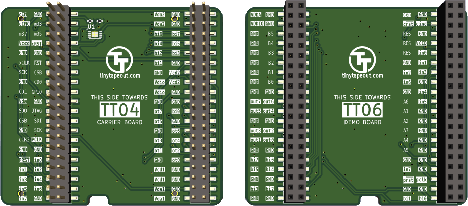
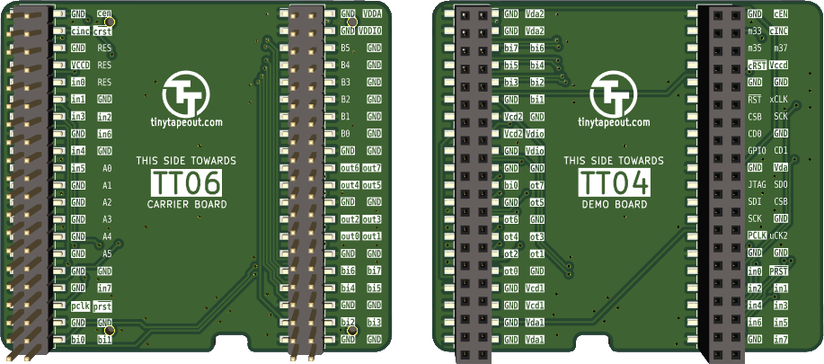

# Tiny Tapeout adapter PCBs

For interfacing between different versions of the [carrier board](https://github.com/TinyTapeout/breakout-pcb/) and the [demo board](https://github.com/TinyTapeout/tt-demo-pcb)

## TT04 carrier board to TT06 demo board

## TT06 carrier board to TT04 demo board

